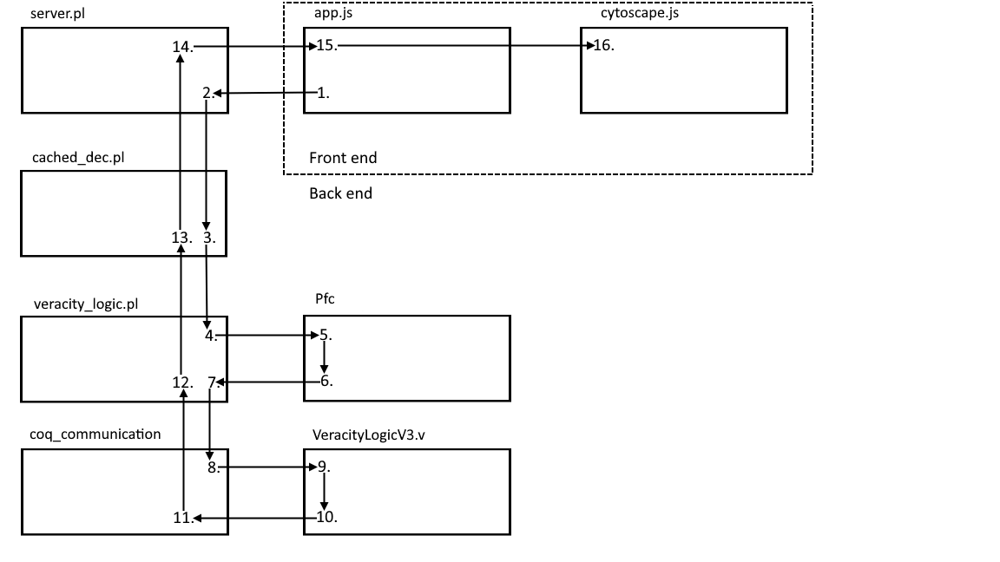

## Description
A summer research project, which involved combining the Event Calculus with the Veracity Logic, implemented in Prolog.

## Required Software
- SWI-Prolog
    - Tested on 9.0.4 for Windows
- Coq
    - Tested on 8.18.0 for Windows
    - Make sure that the location of `coqtop` is added to the `PATH` environment variable
- A browser to view the web app
    - Any should do, though most testing was done using Chromium browsers

## Usage
- To start the server, run `swipl` from the `app` folder, and execute `[server].`
- Visit the front end at http://localhost:8000/
- Type the rules and narrative in the left text area.
    - All events are introduced to the narrative by `happens/2`
    - For non-veracity fluents, standard Event Calculus predicates `initially/1`, `initiates/3`, `terminates/3`, `releases/3` are to be used
    - For veracity fluents, there are two domain specific predicates:
        - set_judgement(Event, Actor, Evidence, Claim, Confidence)
        - set_trust(Event, Trustor, Trustee, Trust_Level)
    - Claim syntax (used in `set_judgement/5`) supports the following conventions:
        - `==>/2` denotes an implicative claim, i.e. `a ==> b` means that forward chaining will derive `b` if `a` is true.
        - `{}/1` describes constraints for the antecedent of an implicative claim; for example, `a(A), b(B), {A > B} ==> b(A)`
            The veracity logic doesn't see these constraints - they are used for restricting forward chaining to prevent the proliferation of irrelevant judgements. Note also that the constraints need to be placed carefully to ensure that variables are ground when called; `a(A), {A > B}, b(B) ==> b(A)` would throw an error.
        - `,/2` is used for conjunction, e.g. given `a, b ==> c`, `c` is derived when both `a` and `b` are true.
        - `;/2` is used for disjunction, e.g. given `a ; b ==> c`, `c` is derived when either `a` or `b` are true.
        - As shown in the constraints explanation, claims can be parameterised. For example, `(c(Obj, Qual, T1), c(Obj, no_change(T1), T2), {T1 < T2} ==> c(Obj, Qual, T2)` is the claim that if Obj has quality Qual at T1, and if at T2 Obj has not changed since T1, then Obj still has quality Qual at T2.   Then we can use this as a template; if throughout the narrative `a1` judges `c(cup, new, 1)` and `c(cup, no_change(1), 2)` to have veracity, `a1` will also believe `c(cup, new, 2)`.
    - **Note:** See the `example` folder for example input code
- When finished writing the code, click `Generate Narrative`. It may take a few seconds for the response to arrive, as Coq is reset between sessions.
- If an error is returned:
    - The server's execution may be blocked; the server needs to be restarted in that case.
    - There may be syntax errors; check the terminal output.
- The `Timeline` slider can be used to move through the narrative, with the rest of the output display dynamically changing to reflect this.
- `Events at this timestamp` and `Fluents just after this timestamp` show the raw Event Calculus output for this timestep.
- `Graph display options` allow you to choose which veracity fluents are displayed in the graph display. Judgements are also marked as having passed or failed formal verification.
- After selecting a node in the graph display (located in the bottom right corner), information relating to that node is shown in the `Information for the selected node` area. If a certain type of judgement is selected from the `Graph display options`, then its proof is shown here.

## Software Architecture

1. The client sends a request to the server to execute some code.
2. The request is received by the server, and the accompanying code is sent to the Event Calculus in order to generate the narrative. Then, the server loops over each timestamp, telling cached_dec.pl to run `tick/0`.
3. At each tick, the DEC handles the fluents and events which aren't related to the Veracity Logic, and calls `veracity_tick/1` located in veracity_logic.pl.
4. This procedure determines which veracity fluents need to be added, updated, or removed.
5. Control is passed to Pfc (through `add/1` and `rem2/1`) for forward chaining. New fluents are derived through inference rules such as trust and implication, and old ones are removed if they no longer have support.   At this stage, judgements' proofs are not ground. This is because there could be multiple sources of verification, e.g. `A \/ B -> C`. `C` becomes true when `A` is true, but if `B` is later confirmed, the proof of `C` may need to be recalculated. Therefore, proofs are left non-ground until they need to be formally verified.
6. After all of the changes have been made for a given timestep, the fluents stored in Pfc are extracted (`pfc/1`).
7. Judgements have their proofs grounded (`ground_judgement/2`), and sent to coq_communication.pl for verification (`verify/3`).
8. The intermediate proof representation for each judgement is translated into Coq syntax - in particular, Prolog terms are not all valid Coq syntax so they need to be renamed appropriately.
9. Translated proofs are sent line-by-line to Coq for formal verification via a pipe.
10. After each tactic, success or failure is reported.
11. The overall success of the judgement's proof verification is determined, and the `verify/3` call is exited.
12. Fluents (as well as their verification status) for a given timestep are sent back to the Event Calculus (through `veracity_fluent/1`).
13. All fluents for a given timestamp are extracted from the Event Calculus (through `fluent/2`); from both cached_dec.pl and veracity_logic.pl.
14. The entire narrative is constructed, and translated into JSON before being sent as a response to the client.
15. The response is received and processed by JavaScript to update the DOM.
16. The graph display is updated as needed.

## Known Issues
There are a couple of small issues that I am aware of, and intend on addressing when I have time:
- Sending too many requests in a short space of time blocks the server. Fixing this should (hopefully) just involve moving execution of requests into separate threads for each request.
- It would be nice to have some sort of indicator to show that the client is still waiting for a response.
- When displaying proofs in the web app, disjunctions' evidence is not tagged.

## Acknowledgements
- Thanks to David Eyers and Stephen Cranefield for supervising this project!
- The logic for veracity, proposed by Steve Reeves in his [2023 paper](https://arxiv.org/abs/2302.06164)
- [Veracity Logic Mechanised](https://github.com/Coda-Coda/Veracity-Logic-Mechanised), a Coq implementation of the logic written by Daniel Britten
- [Prolog forwarding chaining (Pfc)](https://github.com/finin/pfc), written at the Unisys Paoli Research Center
- [Cytoscape.js](https://js.cytoscape.org/) - a library for graph theory analysis and visualisation
- [Cytoscape-klay.js](https://github.com/cytoscape/cytoscape.js-klay) - implements the Klay layout algorithm for Cytoscape.js
- [Klay.js](https://github.com/kieler/klayjs) - a layer-based layout algorithm